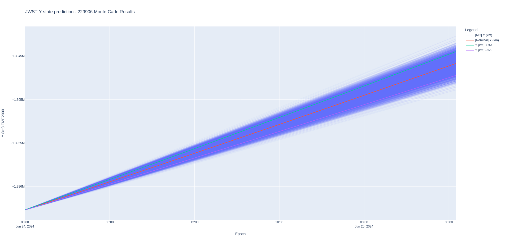
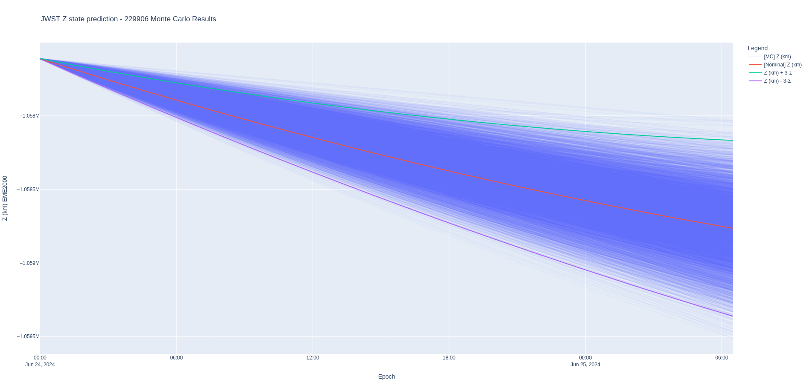

# James Webb Space Telescope covariance Monte Carlo

Spaceflight dynamics requires a lot of statistical analysis to convince ourselves that the results we'll present to all other teams are correct.

In this example, you'll learn how to sample the orbital state from SPICE BSP file (the industry standard for ephemeris information) and build a spacecraft structure around that orbit. Then, we'll build an uncertainty in the position and velocity of that spacecraft, and propagate it into the future.

To run this example, just execute:
```sh
RUST_LOG=info cargo run --example 02_jwst --release
```

Building in `release` mode will make the computation significantly faster. Specifying `RUST_LOG=info` will allow you to see all of the information messages happening in ANISE and Nyx throughout the execution of the program.

## Objective

We aim to compare two different statistical methods in order to demonstrate two advanced features of Nyx.

First, we'll use a _covariance mapping_ approach, whereby the covariance at some time `t0` is propagated to a future time `t1` along with the spacecraft trajectory. This is commonly used for the _time update_ or _prediction_ step of an orbit determination process.

Then, we'll use the Monte Carlo framework of Nyx to propagate the initial spacecraft state after dispersions using all threads of the computer. Multi-threaded propagation is not common in other astrodynamics software.

Finally, we'll check that the 3-sigma (i.e. 99.7%) covariance bounds of the covariance mapping approach matches the Monte Carlo results in terms of uncertainty in the state vector.

## Analysis

**Follow on work in [#327](https://github.com/nyx-space/nyx/issues/327).**





